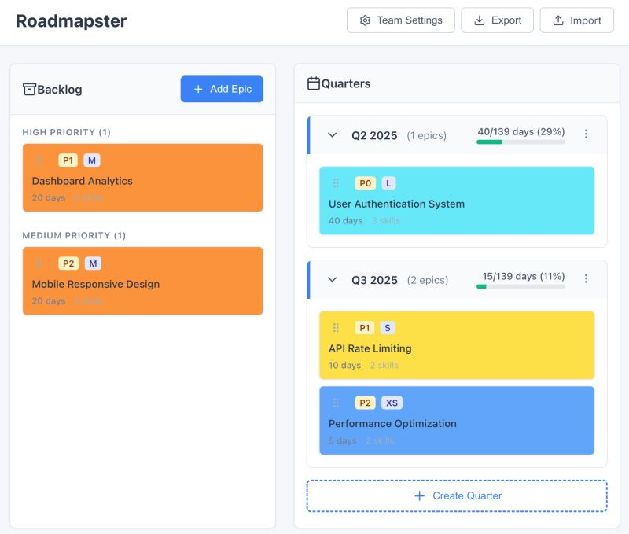
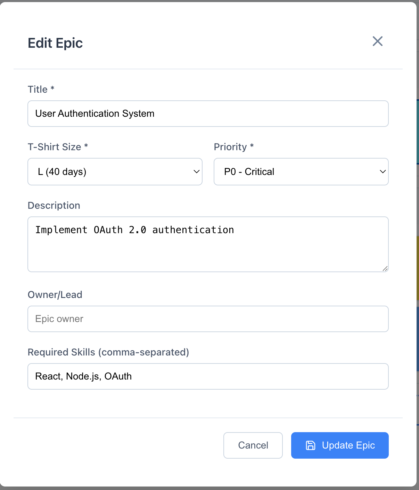
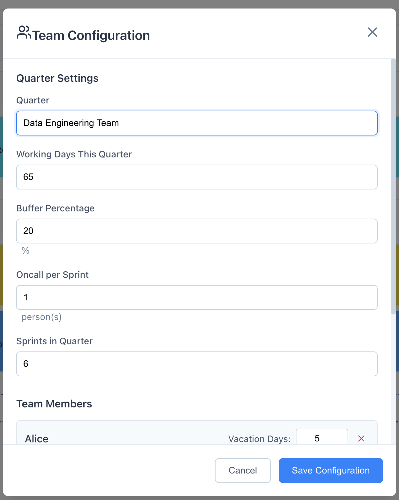

# Roadmapster

A visual capacity planning tool for software development teams that relies on available capacity to guide in planning

## Overview

Roadmapster provides an intuitive drag-and-drop interface for managing team capacity across multiple quarters. Similar to Jira's sprint planning but focused on quarter-level capacity management, it helps teams visualize workload distribution and prevent overcommitment.


*Main planning interface showing backlog and quarterly capacity planning*

## Features

### Core Functionality
- **Visual Capacity Planning**: Drag and drop epics between backlog and quarters
- **Multiple Quarter Management**: Plan multiple quarters ahead with collapsible views
- **Real-time Capacity Tracking**: Visual capacity bars showing utilization per quarter
- **T-shirt Size Estimation**: XS (5 days) to XL (60+ days) sizing system
- **Priority-based Organization**: Automatic grouping by priority (P0-P3)

### Quarter Management
- **Collapsible Quarters**: Expand/collapse quarters for focused planning
- **Quarter Lifecycle**: Planning → Active → Completed states
- **Capacity Validation**: Prevents over-allocation with capacity checks
- **Flexible Configuration**: Customize working days and team settings per quarter

### Team Features
- **Team Configuration**: Set vacation days, oncall rotation, and buffer percentages
- **Capacity Calculations**: Automatic calculation considering vacations and oncall duties
- **Data Persistence**: Local storage for offline capability
- **Import/Export**: JSON-based data export for sharing and backup

## Getting Started

### Prerequisites
- Node.js 16+ and npm
- Modern web browser (Chrome, Firefox, Safari, Edge)

### Installation

1. Clone the repository:
```bash
git clone https://github.com/yourusername/roadmapster.git
cd roadmapster
```

2. Install dependencies:
```bash
npm install
```

3. Start the development server:
```bash
npm run dev
```

4. Open [http://localhost:3000](http://localhost:3000) in your browser

## Project Structure

```
roadmapster/
├── README.md                 # This file
├── CLAUDE.md                # AI assistant instructions
├── package.json             # Node.js dependencies
├── next.config.mjs          # Next.js configuration
├── tsconfig.json            # TypeScript configuration
├── docs/
│   └── PRD.md              # Product Requirements Document
├── app/                     # Next.js app directory
│   ├── layout.tsx          # Root layout
│   ├── page.tsx            # Main page component
│   ├── components/         # React components
│   ├── types/              # TypeScript definitions
│   ├── utils/              # Utility functions
│   └── styles/             # CSS styles
└── images/                  # Screenshots and documentation images
```

## Usage

### Creating Quarters
1. Click "Create Quarter" button at the bottom of the quarters panel
2. Configure quarter name, working days, and status
3. Save to create the new quarter

### Planning Epics
1. Click "Add Epic" in the backlog to create new work items
2. Set title, size, priority, and description
3. Drag epics from backlog to quarters to plan work
4. Reorder epics within quarters by dragging


*Epic creation and editing interface with all configurable fields*

### Managing Capacity
- Each quarter shows real-time capacity utilization
- Green bar: Under 75% capacity (healthy)
- Orange bar: 75-90% capacity (approaching limit)
- Red bar: Over 90% capacity (at risk)

### Team Settings
1. Click "Team Settings" to configure:
   - Team member vacation days
   - Oncall rotation schedule
   - Buffer percentage for unknowns
   - Working days per quarter


*Team configuration interface for managing capacity calculations*

## Technology Stack

- **Framework**: Next.js 14 with React 18 and TypeScript
- **Styling**: CSS3 with modern flexbox/grid layouts
- **Drag & Drop**: @dnd-kit for smooth interactions
- **Icons**: Lucide React icons
- **State Management**: React hooks with localStorage persistence
- **Build Tool**: Next.js with Turbopack

## Development

### Available Scripts

```bash
# Start development server
npm run dev

# Build for production
npm run build

# Start production server
npm start

# Run linter
npm run lint
```

### Key Design Decisions

1. **Single Page Application**: Focused on simplicity and fast interactions
2. **Local Storage**: Enables offline use and quick prototyping
3. **Jira-like UI**: Familiar interface for development teams
4. **Quarter-based Planning**: Aligns with typical business planning cycles

## Future Enhancements

- Backend API integration for team collaboration
- Jira integration for epic synchronization
- Advanced analytics and reporting
- Resource allocation across multiple teams
- Dependency management between epics
- Historical capacity tracking

## Contributing

Contributions are welcome! Please feel free to submit a Pull Request.

## License

This project is licensed under the MIT License - see the LICENSE file for details.

## Acknowledgments

- Inspired by Jira's sprint planning interface
- Built with Create React App
- Uses @dnd-kit for drag and drop functionality